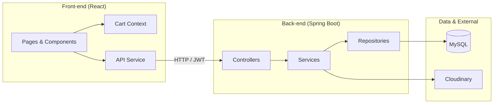
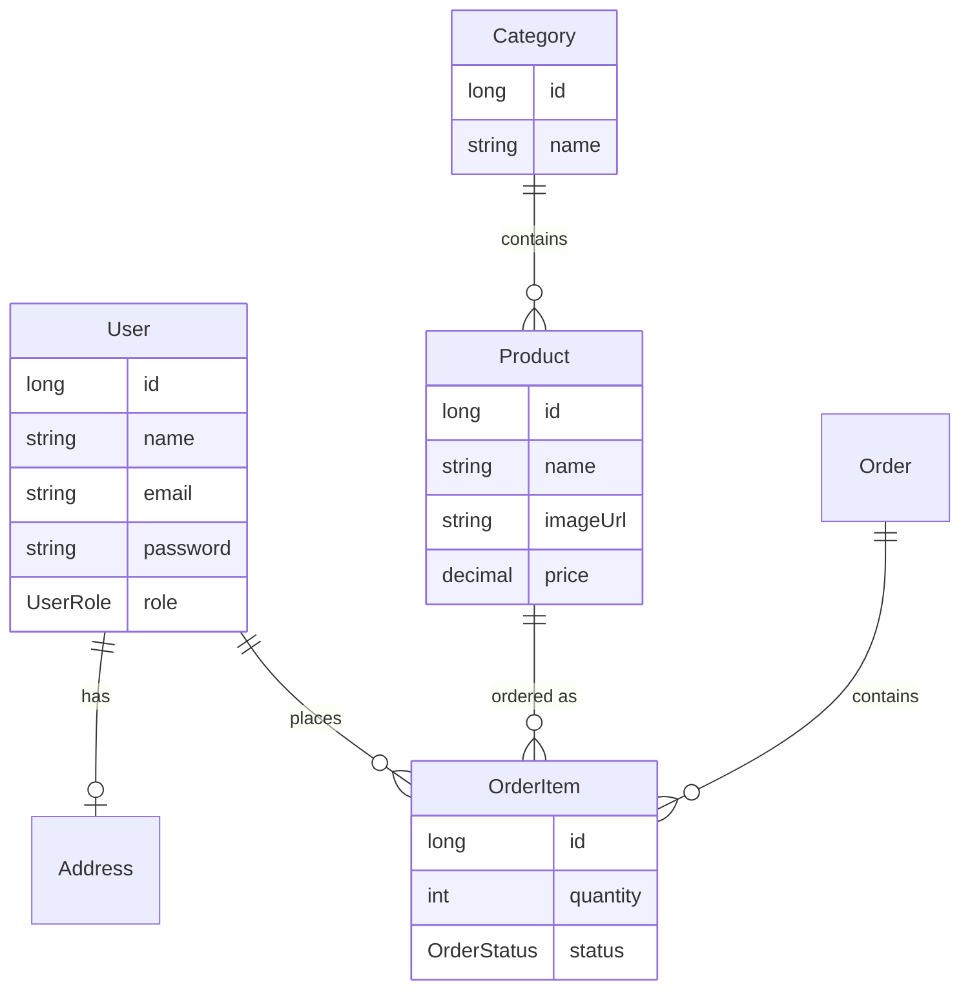

# E-Commerce Platform

A full-stack e-commerce application built with **React** and **Spring Boot**, featuring product catalog, user authentication, shopping cart, order management, and an admin dashboard.

---

## Introduction

This project provides a complete e-commerce solution with a **React 19** front-end and a **Spring Boot 3** back-end. Users can browse products by category, search, add items to cart, and place orders. Administrators can manage categories, products, and orders through a dedicated admin panel. Authentication is handled with **JWT**, and product images are stored via **Cloudinary**.

Whether you're extending this for a real store or learning full-stack development, this codebase offers a clear structure and modern stack to build on.

---

## Key Features

| Area | Features |
|------|----------|
| **Authentication** | JWT-based login/register, role-based access (USER / ADMIN), protected and admin-only routes |
| **Catalog** | Product listing, search, category browsing, product detail pages |
| **Cart** | Add/remove items, persisted in React context, checkout flow |
| **Orders** | Place order, order history, status workflow (PENDING → CONFIRM → SHIPPED → DELIVERED → CANCELLED / RETURNED) |
| **User profile** | Profile view, address management (add/edit) |
| **Admin** | Category CRUD, product CRUD with image upload (Cloudinary), order management and filtering |

---

## Overall Architecture

The application follows a classic **client–server** layout: the React app talks to the Spring Boot API over HTTP; the API uses JPA to persist data in MySQL.



### Request flow (high level)

1. **Front-end:** User action → `ApiService` (axios) → HTTP request with optional `Authorization: Bearer <token>`.
2. **Back-end:** `JwtAuthFilter` validates token → controller → service → repository → database (or Cloudinary for images).
3. **Response:** JSON back to the client; front-end updates state and UI.

### Domain model (simplified)



---

## Installation

### Prerequisites

- **Node.js** 18+ and **npm**
- **Java** 17+ (23 used in the project; compiler is set to 8 in `pom.xml` — adjust if needed)
- **Maven** 3.6+
- **MySQL** 8.x (running and reachable)

### 1. Clone the repository

```bash
git clone <repository-url>
cd E-commerce
```

### 2. Back-end setup

```bash
cd back-end
```

- Create a MySQL database named `ecommerce` (or the name you set in configuration):

```sql
CREATE DATABASE ecommerce CHARACTER SET utf8mb4 COLLATE utf8mb4_unicode_ci;
```

- Install dependencies and run tests (optional):

```bash
./mvnw clean install
# Windows
mvnw.cmd clean install
```

### 3. Front-end setup

```bash
cd front-end
npm install
```

### 4. Environment and configuration

See [Environment configuration](#environment-configuration) below. Configure the back-end (and optionally the front-end) before running.

---

## Running the project

Run **back-end** and **front-end** in separate terminals.

### Start the back-end (Spring Boot)

From the project root:

```bash
cd back-end
./mvnw spring-boot:run
# Windows
mvnw.cmd spring-boot:run
```

The API will be available at **http://localhost:4040** (or the port set in `application.properties`).

### Start the front-end (React)

```bash
cd front-end
npm start
```

The app will open at **http://localhost:3000** and will call the back-end at the URL configured in your API service (e.g. `http://localhost:4040`).

### Quick check

- Open http://localhost:3000 → home page.
- Register a user, log in, browse categories and products, add to cart, and place an order.
- Log in as an admin user to access `/admin` for categories, products, and orders.

---

## Environment configuration

### Back-end (`back-end/src/main/resources/application.properties`)

Configure the following (use environment variables or a profile-specific file in production; avoid committing secrets).

| Property | Description | Example |
|----------|-------------|---------|
| `server.port` | API port | `4040` |
| `spring.datasource.url` | MySQL JDBC URL | `jdbc:mysql://localhost:3306/ecommerce` |
| `spring.datasource.username` | DB user | `root` |
| `spring.datasource.password` | DB password | *(your password)* |
| `spring.jpa.hibernate.ddl-auto` | Schema strategy | `update` (use `validate` in prod) |
| `secretJwtString` | JWT signing secret (long, random) | *(strong secret)* |
| `cloudinary.cloud-name` | Cloudinary cloud name | From Cloudinary dashboard |
| `cloudinary.api-key` | Cloudinary API key | From Cloudinary dashboard |
| `cloudinary.api-secret` | Cloudinary API secret | From Cloudinary dashboard |

**Example (minimal local overrides):**

```properties
# application-local.properties (do not commit)
spring.datasource.url=jdbc:mysql://localhost:3306/ecommerce
spring.datasource.username=root
spring.datasource.password=your_password
secretJwtString=your-long-random-jwt-secret
cloudinary.cloud-name=your_cloud_name
cloudinary.api-key=your_api_key
cloudinary.api-secret=your_api_secret
```

Run with: `./mvnw spring-boot:run -Dspring-boot.run.profiles=local`

### Front-end API base URL

The front-end calls the back-end via `ApiService`. The base URL is set in:

- **File:** `front-end/src/service/apiService.js`
- **Current default:** `http://localhost:4040`

For different environments, you can:

- Replace the static `BASE_URL` with a value from `process.env.REACT_APP_API_URL`, and set `REACT_APP_API_URL` in `.env` (e.g. `REACT_APP_API_URL=http://localhost:4040`).

**Example `.env` for front-end:**

```env
REACT_APP_API_URL=http://localhost:4040
```

---

## Folder structure

```
E-commerce/
├── back-end/                    # Spring Boot API
│   ├── src/main/java/com/karot/ecommerce/
│   │   ├── config/              # Cloudinary, etc.
│   │   ├── controller/          # REST controllers (Auth, Product, Category, Order, User, Address)
│   │   ├── dto/                 # Request/response DTOs
│   │   ├── entity/              # JPA entities (User, Product, Category, Order, OrderItem, Address, …)
│   │   ├── enums/               # OrderStatus, UserRole
│   │   ├── exception/           # Global exception handling, custom exceptions
│   │   ├── mapper/              # Entity ↔ DTO mapping
│   │   ├── repository/          # Spring Data JPA repositories
│   │   ├── security/            # JWT filter, UserDetails, Security config, CORS
│   │   ├── service/             # Business logic (interfaces + impl)
│   │   └── specification/       # JPA specifications (e.g. order filtering)
│   ├── src/main/resources/
│   │   └── application.properties
│   ├── pom.xml
│   └── mvnw, mvnw.cmd
│
├── front-end/                   # React SPA
│   ├── public/                  # Static assets, index.html
│   └── src/
│       ├── component/
│       │   ├── admin/           # Admin pages (categories, products, orders, add/edit)
│       │   ├── common/         # NavBar, Footer, ProductList, Pagination
│       │   ├── context/        # CartContext
│       │   └── pages/          # Home, ProductDetails, Category, Cart, Login, Register, Profile, Address
│       ├── service/            # apiService.js, Guard.js (ProtectedRoute, AdminRoute)
│       ├── style/              # CSS per page/component
│       ├── assets/             # Images, etc.
│       ├── App.js              # Routes and layout
│       └── index.js
│
└── README.md
```

---

## Contribution guidelines

We welcome contributions that improve code quality, docs, or features.

### How to contribute

1. **Fork** the repository and create a branch from `main` (or the default branch):
   ```bash
   git checkout -b feature/your-feature-name
   ```
2. **Follow existing style:** Java (Back-end): project formatting and naming; Front-end: existing React/JSX and file structure.
3. **Keep changes focused:** Prefer small, reviewable PRs (one feature or fix per PR).
4. **Test:** Run the back-end and front-end locally; ensure existing flows still work.
5. **Commit:** Use clear messages (e.g. `Add product search by category`, `Fix cart total when quantity changes`).
6. **Push** your branch and open a **Pull Request** against the upstream repository. Describe what changed and why.
7. **Address review** feedback; maintainers may request edits before merge.

### Reporting issues

Open an issue with:

- A short title and description.
- Steps to reproduce (for bugs).
- Your environment (OS, Node/Java versions, browser if relevant).
- Logs or screenshots when helpful.

### Code of conduct

Be respectful and constructive. We aim to keep the community inclusive and focused on the project.

---

## License

This project is provided as-is. See the repository for any license file (e.g. `LICENSE` in the root or in `back-end`/`front-end`). If none is specified, assume **proprietary** or **unlicensed** and confirm with the repository owner before reuse or distribution.

---

## Roadmap

- [ ] **Admin orders:** Expose and wire admin order management UI (route exists in code, can be enabled and connected to existing order APIs).
- [ ] **Product reviews:** Back-end has a `Review` entity; add API and front-end UI for ratings/reviews.
- [ ] **Payments:** Integrate a payment provider (e.g. Stripe) using the existing `Payment` entity and order flow.
- [ ] **Environment-based config:** Move secrets and env-specific values to environment variables (and `.env` / Spring profiles) for all environments.
- [ ] **Front-end env:** Use `REACT_APP_*` for API URL and feature flags to support staging/production builds.
- [ ] **Tests:** Expand unit and integration tests for API and critical front-end paths.
- [ ] **Documentation:** Add OpenAPI/Swagger for the REST API and optional Postman/Insomnia collection.
- [ ] **Performance:** Add caching (e.g. Spring Cache, Redis) for catalog and category endpoints.
- [ ] **Deployment:** Add Docker Compose (API + DB + optional front-end) and deployment notes for cloud (e.g. Vercel + backend host).

---

*For questions or suggestions, open an issue or start a discussion in the repository.*
